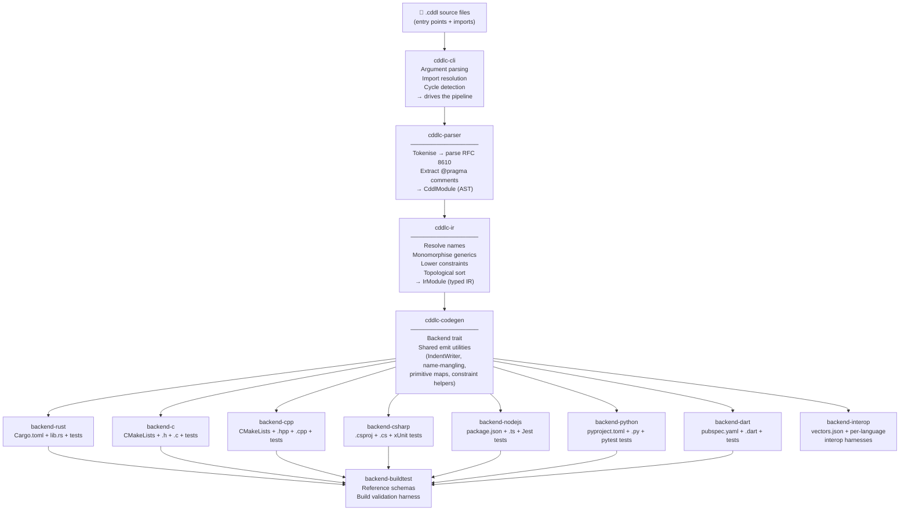

# cddlc — CDDL Compiler and Code Generator

`cddlc` parses [RFC 8610 CDDL](https://www.rfc-editor.org/rfc/rfc8610) schema files and generates
serialization/deserialization code for multiple target languages.  A single `.cddl` schema
produces a ready-to-build library — with types, encode/decode logic, and roundtrip tests — for
Rust, C, C++, C#, Node.js/TypeScript, Python, and Dart.

## Why cddlc?

CDDL (Concise Data Definition Language) is the schema language for CBOR-based protocols
(CoAP, COSE, CWT, and others).  Writing serialization boilerplate by hand across seven languages
is error-prone and hard to keep in sync.  `cddlc` turns the authoritative schema into the
implementation: change the schema, regenerate, done.

---

## Architecture

The tool is a Rust workspace of independent crates organised as a classic compiler pipeline.



### Crate responsibilities

| Crate | Role |
|---|---|
| [`cddlc-parser`](crates/cddlc-parser) | RFC 8610 grammar → AST; pragma extraction |
| [`cddlc-ir`](crates/cddlc-ir) | Name resolution, generic monomorphisation, constraint lowering, topo-sort → typed IR |
| [`cddlc-codegen`](crates/cddlc-codegen) | `Backend` trait + shared emit utilities used by all backends |
| [`cddlc-cli`](crates/cddlc-cli) | CLI argument parsing, `@import` resolution with cycle detection |
| [`backend-rust`](crates/backend-rust) | Rust + minicbor / ciborium (with `#![no_std]` support) |
| [`backend-c`](crates/backend-c) | ANSI C + nanocbor / tinycbor / zcbor |
| [`backend-cpp`](crates/backend-cpp) | C++17 + nanocbor (wraps the C runtime) |
| [`backend-csharp`](crates/backend-csharp) | C# / .NET 8 + `System.Formats.Cbor` |
| [`backend-nodejs`](crates/backend-nodejs) | TypeScript 5 ESM + cborg (CBOR) or `node:buffer` (JSON) |
| [`backend-python`](crates/backend-python) | Python 3 dataclasses + cbor2 / json |
| [`backend-dart`](crates/backend-dart) | Dart 3 / Flutter + cbor ^6 (CBOR) or `dart:convert` (JSON) |
| [`backend-interop`](crates/backend-interop) | Canonical CBOR test vectors + per-language decode/roundtrip harnesses |
| [`backend-buildtest`](crates/backend-buildtest) | Reference schemas; build validation tests (invoke real toolchains) |

---

## Quick Start

### Build from source

```bash
git clone <repo-url>
cd cddlc
cargo build --release
# binary at: ./target/release/cddlc
```

### Generate a Rust library

```bash
cddlc my_schema.cddl --lang rust --output generated/
```

### Generate for other languages

```bash
cddlc my_schema.cddl --lang c        --output generated/
cddlc my_schema.cddl --lang cpp      --output generated/
cddlc my_schema.cddl --lang csharp   --output generated/
cddlc my_schema.cddl --lang nodejs   --output generated/
cddlc my_schema.cddl --lang python   --output generated/
cddlc my_schema.cddl --lang dart     --output generated/
```

### JSON instead of CBOR

```bash
cddlc my_schema.cddl --lang python --format json --output generated/
```

---

## CLI Reference

```
cddlc [OPTIONS] <INPUT>...

Arguments:
  <INPUT>...    One or more .cddl source files (entry points)

Options:
  -l, --lang <LANG>               Target language [default: rust]
                                  [values: rust, c, cpp, csharp, nodejs, python, dart]
  -o, --output <DIR>              Output directory [default: ./generated]
      --format <FMT>              Serialization format [default: cbor]
                                  [values: cbor, json]
  -r, --runtime <NAME>            CBOR runtime library [default: minicbor]
                                  rust:  minicbor | ciborium | cbor4ii
                                  c/cpp: tinycbor | nanocbor | zcbor
      --alloc <STRATEGY>          Allocation strategy [default: arena]
                                  [values: stack, arena, heap]
      --no-std                    Rust only: emit #![no_std] + heapless collections
      --dcbor                     Emit deterministic (dCBOR, RFC 8949 §4.2) encoding
      --depth-limit <N>           Max decoder nesting depth [default: 16]
      --max-array <N>             Capacity for unbounded sequences [* T] [default: 16]
      --max-str <N>               Capacity for unbounded strings [default: 64]
      --namespace <NS>            Namespace/module prefix for emitted symbols
      --include-dir <DIR>         Additional search path for @import (repeatable)
      --interop                   Generate cross-language interop test vectors
      --interop-langs <LIST>      Comma-separated list of interop harness languages
                                  [default: rust,c,cpp,csharp,nodejs,python]
      --dry-run                   Parse and analyse only; do not write files
      --debug-parse               Print rich parse diagnostics (also: CDDLC_TRACE=1)
  -v, --verbose                   Print resolved types, warnings, file paths
  -h, --help                      Print help
  -V, --version                   Print version
```

---

## Pragma Reference

Pragmas are structured comments that influence code generation.  They appear on the line
immediately before the rule they annotate.

```cddl
; @capacity 32
; @doc "A list of recent sensor readings"
readings = [* sensor-reading]
```

| Pragma | Value | Description |
|---|---|---|
| `@import "path"` | Quoted path | Include another `.cddl` file (relative to the importing file, or `--include-dir`) |
| `@capacity N` | Integer | Maximum element count for `[* T]` / `[+ T]` arrays (overrides `--max-array`) |
| `@str-capacity N` | Integer | Maximum character count for unbounded `tstr` (overrides `--max-str`) |
| `@doc "text"` | String | Documentation comment attached to the generated type |
| `@deprecated` | — | Emits a deprecation annotation on the generated type |
| `@default value` | Literal | Default value for a field |
| `@regex-hook name` | Identifier | C/Rust function name to call for `.regexp` constraint validation |
| `@skip-validation` | — | Suppress constraint checks for a field |
| `@opaque` | — | Treat the type as raw bytes (pass-through, no decode) |

---

## Supported CDDL Constructs

| Feature | Syntax | Notes |
|---|---|---|
| Primitives | `bool`, `uint`, `int`, `float32`, `float64`, `tstr`, `bstr`, `any` | `float16` maps to `float32`/`double` |
| Named structs | `foo = { field: type, ? opt: type }` | Optional fields, integer map keys |
| Type choices (enums) | `status = "ok" / "warn" / "error"` | String, integer, or mixed variants |
| Arrays | `readings = [* float32]`, `[+ T]`, `[n*m T]` | Capacity from pragma or `--max-array` |
| Open maps | `props = { * tstr => any }` | Typed key/value maps |
| Type aliases | `device-id = tstr .size 16` | With optional constraints |
| CBOR tags | `#6.1(uint)` | Tag verification on decode, emission on encode |
| Generics | `pair<T> = [T, T]` | Monomorphised at use sites |
| Imports | `; @import "common.cddl"` | Transitive, cycle-detected |
| Constraints | `.size`, `.range`, `.ge`, `.le`, `.gt`, `.lt`, `.eq`, `.ne`, `.regexp`, `.cbor`, `.cborseq` | |
| Embedded CBOR | `.cbor T`, `.cborseq T` | Inner `bstr` decoded as `T` |

---

## Backend Capability Matrix

| Feature | Rust | C | C++ | C# | Node.js | Python | Dart |
|---|:---:|:---:|:---:|:---:|:---:|:---:|:---:|
| CBOR encode/decode | ✓ | ✓ | ✓ | ✓ | ✓ | ✓ | ✓ |
| JSON encode/decode | ✓ | ✓ | ✓ | ✓ | ✓ | ✓ | ✓ |
| Structs | ✓ | ✓ | ✓ | ✓ | ✓ | ✓ | ✓ |
| Enums (string/int/mixed) | ✓ | ✓ | ✓ | ✓ | ✓ | ✓ | ✓ |
| Arrays / typed lists | ✓ | ✓ | ✓ | ✓ | ✓ | ✓ | ✓ |
| Type aliases | ✓ | ✓ | ✓ | ✓ | ✓ | ✓ | ✓ |
| CBOR tags | ✓ | ✓ | ✓ | ✓ | ✓ | ✓ | ✓ |
| Optional fields | ✓ | ✓ | ✓ | ✓ | ✓ | ✓ | ✓ |
| Roundtrip tests | ✓ | ✓ | ✓ | ✓ | ✓ | ✓ | ✓ |
| Inline constraint validation | ✓ | ✓ | ✓ | partial | partial | partial | — |
| dCBOR deterministic encoding | ✓ | ✓ | ✓ | ✓ | ✓ | ✓ | — |
| `#![no_std]` support | ✓ | N/A | N/A | N/A | N/A | N/A | N/A |
| Interop test harness | ✓ | ✓ | ✓ | ✓ | ✓ | ✓ | — |

---

## Interoperability Testing

`--interop` generates canonical CBOR test vectors (using the Rust encoder as the reference
implementation) plus decode/roundtrip harnesses for each target language.  This lets you confirm
that a Rust encoder and a Python decoder agree on the wire format.

```bash
cddlc my_schema.cddl --interop --interop-langs rust,python -o generated/
```

Output layout:

```
generated/
  my_schema-cbor/          ← the generated library
  my_schema-interop/
    vectors.json           ← human-readable test vectors
    vectors.cbor           ← binary CBOR version of the vectors
    rust/interop_test.rs
    c/test_interop.c
    cpp/test_interop.cpp
    csharp/InteropTests.cs
    nodejs/interop.test.ts
    python/test_interop.py
```

See [`docs/interop-testing.md`](docs/interop-testing.md) for detailed instructions per language.

---

## Running the Build Validation Tests

The `backend-buildtest` crate invokes the real language toolchains to verify that generated code
actually compiles.  These tests are marked `#[ignore]` so they do not run in normal CI.

```bash
# All languages (requires all toolchains installed):
cargo test -p backend-buildtest --test build_validation -- --ignored --nocapture

# Single language:
cargo test -p backend-buildtest --test build_validation test_build_rust -- --ignored --nocapture
```

---

## Known Gaps and Future Enhancements

### Missing backends

| Language | Priority | Notes |
|---|---|---|
| Java / Kotlin | High | Very common for IoT firmware and Android |
| Swift | High | Required for Apple ecosystem / CoreBluetooth |
| Go | Medium | Widely used in cloud/IoT gateway code |
| Zig | Low | Attractive for embedded / no-std targets |

### Per-backend gaps

- **Dart**: missing dCBOR deterministic encoding, constraint validation, and interop harness generation.
- **C# / Node.js / Python**: constraint validation is partial (`.size`, `.range` checks only; `.regexp` not enforced).
- **C / C++**: no JSON mode; JSON output is only available for higher-level language backends.
- **Rust**: `ciborium` and `cbor4ii` runtime options are listed in the CLI but the backend only fully implements `minicbor`.

### Schema language gaps

- **Generics with multiple parameters** (`pair<T, U>`) are not yet monomorphised correctly in all cases.
- **Group-level choices** (`//=` extensions) have limited support — only the first group choice is lowered.
- **Unwrapped groups** (`~group`) are not fully handled.
- **Occurrence in struct fields beyond `?`** (e.g. `* field: T`) is not modelled as repeated struct fields.
- **Socket/plug rules** (`$socket /= T`) are not supported.

### Tooling gaps

- No **watch mode** — regeneration requires re-running the CLI manually.
- No **schema validation** against actual CBOR/JSON data (separate from code generation).
- No **schema diff / migration** tooling to detect breaking changes between schema versions.
- No **JSON Schema** or **Protobuf** import — `cddlc` is CDDL-only.
- The `--dry-run` flag reports type counts but does not emit a machine-readable IR dump.
- `@doc` pragma content is preserved in the IR but not all backends render it as proper
  language-native doc comments (e.g. Rust `///`, C# `///`, TypeScript JSDoc).
- The interop test harness does not include Dart.
- No published crate on crates.io; must build from source.

---

## Project Layout

```
cddlc/
├── Cargo.toml                 Workspace manifest
├── crates/
│   ├── cddlc-parser/          RFC 8610 parser
│   ├── cddlc-ir/              IR lowering
│   ├── cddlc-codegen/         Backend trait + utilities
│   ├── cddlc-cli/             CLI entry point
│   ├── backend-rust/
│   ├── backend-c/
│   ├── backend-cpp/
│   ├── backend-csharp/
│   ├── backend-nodejs/
│   ├── backend-python/
│   ├── backend-dart/
│   ├── backend-interop/       Cross-language interop vectors
│   └── backend-buildtest/     Build validation harness (submodule)
├── docs/
│   └── interop-testing.md
└── test_all                   Shell script: run all backend smoke tests
```

---

## License

Licensed under MIT OR Apache-2.0 at your option.
